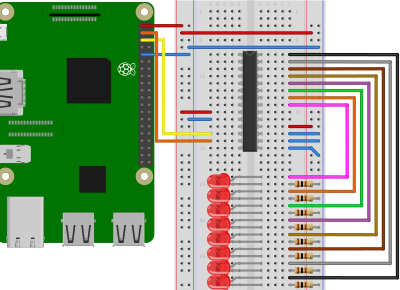

# binary-counter
In this project, eight LEDs build up an 8-Bit counter, counting from 0 to 255, using nothing but a Raspberry Pi, some 
electrical components and TypeScript.
It shows visually how numbers are counted in a binary system from 0 to 255.

After finishing this project, you should be able to see the LEDs light up, depending on the binary value of the current 
number.

## Table of contents
1. [Components](#components)
2. [Design](#design)
3. [Circuit Diagram](#circuit-diagram)
4. [Dependencies](#dependencies)
5. [Code](#code)
6. [Run application](#run-application)
7. [Notes](#notes)
8. [Further reading](#further-reading)

## Components
- 1x Raspberry Pi 3
- 1x Breadboard
- 1x MCP23017 Port Expander
- 8x 100&Omega; resistors
- 8x LED (color does not really matter, we used red ones)
- 16x Male-to-male jumper wires
- 4x Female-to-male jumper wires

## Design



*Diagram created using [Fritzing](https://fritzing.org/home/)*

E.g. if the number is 1100100<sub>2</sub> (100<sub>10</sub>), the first, second and fifth LED (from top to bottom) should be on, while the others are off.

## Circuit Diagram
Coming soon

## Dependencies
In order to be able to use TypeScript and the other packages, we need to include these dependencies in a package.json file.
The packages needed in this project are

- [rpio](https://www.npmjs.com/package/rpio)
- [typescript](https://www.npmjs.com/package/typescript)
- [ts-node](https://www.npmjs.com/package/ts-node)

As a reference, the full can be found in the [package.json](./package.json) file.

## Code
Coming soon

## Run application
Open the console in the directory in which you stored the package.json file on your Raspberry Pi.

To run the application, type
```shell script
sudo npm run start
```
in the console.
After a short time you should be able to see the LEDs light up, starting from 0 (all LEDs off) up to 255 (all LEDs) on.
For getting access to I2C, PWM, and SPI, we need root access and therefore we prepend `sudo` before our `npm run start` 
command.

## Notes
### Improve Design
Instead of using 8 different resistors, it is possible to achieve the same result with a single resistor.
Therefore, the number of necessary elements can be reduced.

Coming soon: Calculation (LED in parallel with a single resistor as output). 

### Use GPB

#### GPB Design
Careful: Although the GPB bank is exactly on the opposite side of the GPA bank, the pin numbering is in reverse order.
So across GPA0 is GPB7 and across GPA7 is GPB0. 
You can find the full schematic in the datasheet.

Coming soon

#### GPB Code

Although we didn't use the second bank the MCP23017 offers, it is possible to simultaneously also run the second bank.
This means, that we get 16 additional GPIO ports with one port expander.
It is relatively easy to use.
If for example we want to duplicate the binary counter on the GPB bank, we have to modify the code slightly.
First, we need to provide the address of the new bank.
```typescript
const IODIRB_ADDRESS = 0x01;
const OLATB_ADDRESS = 0x15;
```
Second, we need to activate the second bank
```typescript
rpio.i2cWrite(Buffer.from([IODIRA_ADDRESS, IODIR_OUTPUT]));
rpio.i2cWrite(Buffer.from([IODIRB_ADDRESS, IODIR_OUTPUT]));
```
When we now count inside the loop, we need to add the code for writing to the second bank.
The full loop will looks like this
```typescript
for (let i = 0; i < 256; i++) {
    console.log(`Counter at ${i}`);
    rpio.i2cWrite(Buffer.from([OLATA_ADDRESS, i]));
    rpio.i2cWrite(Buffer.from([OLATB_ADDRESS, i]));
    rpio.sleep(1);
}
```
When finishing the program, we must not forget to also reset the pins for the second bank.
```typescript
rpio.i2cWrite(Buffer.from([OLATB_ADDRESS, 0x00]));
``` 

As a reference, the full code can be found in the [index-gpb.ts](./src/index-gpb.ts) file.

## Further reading
Coming soon
