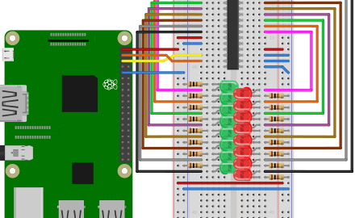

# binary-counter
In this project, eight LEDs build up an 8-Bit counter, counting from 0 to 255, using nothing but a Raspberry Pi, some 
electrical components and TypeScript.
It shows visually how numbers are counted in a binary system from 0 to 255.

After finishing this project, you should be able to see the LEDs light up, depending on the binary value of the current 
number.

## Table of contents
1. [Components](#components)
2. [Design](#design)
3. [Circuit Diagram](#circuit-diagram)
4. [Dependencies](#dependencies)
5. [Code](#code)
6. [Run application](#run-application)
7. [Notes](#notes)
    - [SMBus](#smbus)
    - [GPB](#gpb)
8. [Further reading](#further-reading)

## Components
- 1x Raspberry Pi 3
- 1x Breadboard
- 1x MCP23017 Port Expander
- 8x 100&Omega; resistors
- 8x LED (color does not really matter, we used red ones)
- 16x Male-to-male jumper wires
- 4x Female-to-male jumper wires

## Design


*Diagram created using [Fritzing](https://fritzing.org/home/)*

E.g. if the number is 1100100<sub>2</sub> (100<sub>10</sub>), the first, second and fifth LED (from bottom to top) 
should be on, while the others are off.

## Circuit Diagram


*Diagram created using [EasyEDA](https://easyeda.com/)*

## Dependencies
In order to be able to use TypeScript and the other packages, we need to include these dependencies in a package.json file.
The packages needed in this project are

- [rpio](https://www.npmjs.com/package/rpio)
- [typescript](https://www.npmjs.com/package/typescript)
- [ts-node](https://www.npmjs.com/package/ts-node)

As a reference, the full can be found in the [package.json](./package.json) file.

## Code
With the configuration from above, our MCP23017 has a physical address of `0x20`.
We can store this in a variable
```typescript
const MCP23017_ADDRESS = 0x20;
``` 
Next we need to activate the necessary bank.
We are working with bank A, meaning we want to enable `GPA0` up to `GPA7`.
The addresses for the activation and the GPA bank are
```typescript
const IODIRA_ADDRESS = 0x00;
const OLATA_ADDRESS = 0x14;
const IODIR_OUTPUT = 0x00;
```
`IODIRA` is used for configuring bank A as an output or input.
With the code `0x00`, we can configure this bank to serve as an output.
`OLATA` is the actual bank and with that we can address each of the pins.

Each of the 8 pins has a physical address and can be turned on, depending on the code that was sent.
The pins follow a binary pattern and can therefore be configured over a hexadecimal code.
The following table describes how each pin can be activated.

| Pin  | Code |
| ---- | ---- |
| GPA0 | 0x1  |
| GPA1 | 0x2  |
| GPA2 | 0x4  |
| GPA3 | 0x8  |
| GPA4 | 0x10 |
| GPA5 | 0x20 |
| GPA6 | 0x40 |
| GPA7 | 0x80 |

With a binary OR we can configure which pins are on and with a binary AND which pins are off.

With this knowledge we can start the i2c part.
```typescript
rpio.i2cBegin();
```
We need to set the MCP23017 to be addressable and therefore need to set the slave address.
```typescript
rpio.i2cSetSlaveAddress(MCP23017_ADDRESS);
```
Now we need to activate GPA.

One `rpio` write command expects a buffer, which holds the addresses of the banks and pins we want to configure.
If comparing with the Raspberry's `i2cset` command, each buffer value holds one parameter, in sequential order.
So for example, if the command would be `i2cset -y 1 0x20 0x14 0x01`, the corresponding `rpio` command would be
```typescript
rpio.i2cSetSlaveAddress(0x20);
rpio.i2cWrite(Buffer.from([0x14, 0x01]));
```
Activating the GPA bank will then look like this
```typescript
rpio.i2cWrite(Buffer.from([IODIRA_ADDRESS, IODIR_OUTPUT]));
```
With this, we have configured GPA to serve as an output.

Now we can start the actual counting.
We don't really need to control each pin individually, but can just run a loop, in which we increment the counter.
With the 8 pins, we can have 2^8=256 different values and therefore we need to run over all possible values.
```typescript
for (let i = 0; i < 256; i++) {
    rpio.i2cWrite(Buffer.from([OLATA_ADDRESS, i]));
    rpio.sleep(1);
}
```
In the first row of the for loop, we tell the GPA bank which pins to activate with the `i` counter.
The second row says, that before we continue, the execution should sleep for 1 second.

Before the application finishes, we want to deactivate all pins and we need to close the i2c channel.
```typescript
rpio.i2cWrite(Buffer.from([OLATA_ADDRESS, 0x00]));
rpio.i2cEnd();
```

As a reference, the full can be found in the [index.ts](./src/index.ts) file.

## Run application
Open the console in the directory in which you stored the package.json file on your Raspberry Pi.

To run the application, type
```shell script
sudo npm run start
```
in the console.
After a short time you should be able to see the LEDs light up, starting from 0 (all LEDs off) up to 255 (all LEDs) on.
For getting access to I2C, PWM, and SPI, we need root access and therefore we prepend `sudo` before our `npm run start` 
command.

## Notes
### SMBus
Some of you may know, that we have different busses when working with the Raspberry Pi.
But since `rpio` handles this automatically, we don't need to worry about the correct bus selection and just have to think 
about the physical addresses on the i2c bus. 

### GPB
The MCP23017 has one additional bank we can use: the GPB bank.
It works the same way as the GPA bank, but with a slightly different address.
With that, the MCP23017 offers in total 16 additional GPIO pins.
To show how it works, we will copy the 8-bit binary counter and display it  

#### GPB Components
We add to the design above 

#### GPB Design
Careful: Although the GPB bank is exactly on the opposite side of the GPA bank, the pin numbering is in reverse order.
Across GPA0 is GPB7 and across GPA7 is GPB0. 
You can find the full schematic in the datasheet.



*Diagram created using [Fritzing](https://fritzing.org/home/)*


#### GPB Code

Although we didn't use the second bank the MCP23017 offers, it is possible to simultaneously also run the second bank.
This means, that we get 16 additional GPIO ports with one port expander.
It is relatively easy to use.
If for example we want to duplicate the binary counter on the GPB bank, we have to modify the code slightly.
First, we need to provide the address of the new bank.
```typescript
const IODIRB_ADDRESS = 0x01;
const OLATB_ADDRESS = 0x15;
```
Second, we need to activate the second bank
```typescript
rpio.i2cWrite(Buffer.from([IODIRA_ADDRESS, IODIR_OUTPUT]));
rpio.i2cWrite(Buffer.from([IODIRB_ADDRESS, IODIR_OUTPUT]));
```
When we now count inside the loop, we need to add the code for writing to the second bank.
The full loop will looks like this
```typescript
for (let i = 0; i < 256; i++) {
    console.log(`Counter at ${i}`);
    rpio.i2cWrite(Buffer.from([OLATA_ADDRESS, i]));
    rpio.i2cWrite(Buffer.from([OLATB_ADDRESS, i]));
    rpio.sleep(1);
}
```
When finishing the program, we must not forget to also reset the pins for the second bank.
```typescript
rpio.i2cWrite(Buffer.from([OLATB_ADDRESS, 0x00]));
``` 

As a reference, the full code can be found in the [index-gpb.ts](./src/index-gpb.ts) file.

## Further reading
With the code from above, we are able to address all 16 pins of one MCP23017.
If we concatenate more MCP23017 on the same I2C bus, it is possible to get more GPIO pins and work with them.
The following projects show exactly that
1. [16-Bit binary counter](./binary-counter-16-bit)
2. [Tetris](../tetris)
