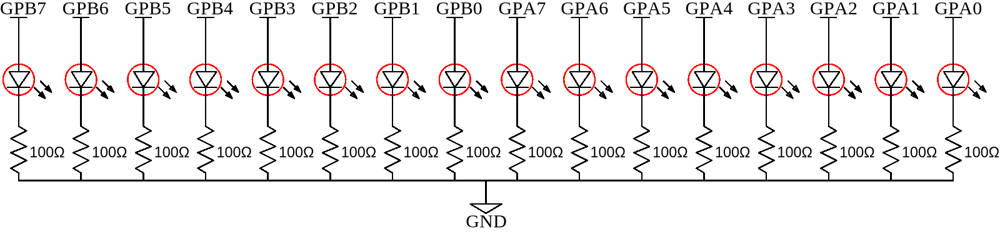

# binary-counter-16-bit
This is the second example for a binary counter with a MCP23017.
It lights the 16 LEDs in a binary pattern up, by using nothing but a Raspberry Pi, some electrical components and 
TypeScript.
After finishing this project, you should be able to see each of the 16 LEDs
light up in a binary order.

## Table of contents
1. [Components](#components)
2. [Design](#design)
3. [Circuit Diagram](#circuit-diagram)
4. [Dependencies](#dependencies)
5. [Code](#code)
6. [Run application](#run-application)
7. [Notes](#notes)
8. [Further reading](#further-reading)

## Components
- 1x Raspberry Pi 3
- 1x Breadboard
- 1x MCP23017 Port Expander
- 16x 100&Omega; resistors
- 16x LED (color does not really matter, we used red ones)
- 24x Male-to-male jumper wires
- 4x Female-to-male jumper wires

## Design


*Diagram created using [Fritzing](https://fritzing.org/home/)*

## Circuit Diagram



*Diagram created using [EasyEDA](https://easyeda.com/)*

## Dependencies
In order to be able to use TypeScript and the other packages, we need to include these dependencies in a package.json file.
The packages needed in this project are

- [rpio](https://www.npmjs.com/package/rpio)
- [typescript](https://www.npmjs.com/package/typescript)
- [ts-node](https://www.npmjs.com/package/ts-node)

As a reference, the full can be found in the [package.json](./package.json) file.

## Code
The code is pretty similar to the [index-gpb.ts](../src/index-gpb.ts) code of the [8-bit binary counter](..) project.
The only thing we have to change is the loop.

We want to extend this by another loop. As soon as the GPA counter (least significant bits) has finished, we want to 
increase the value of the GPB counter (most significant bits).
We can do this by having one outer loop for the most significant bits (GPB) and one inner loop for the least significant 
bits (GPA).
The code will then look like in the following part.
```typescript
let counter = 0;
for (let i = 0; i < 256; i++) {
    rpio.i2cWrite(Buffer.from([OLATB_ADDRESS, i]));
    for (let j = 0; j < 256; j++) {
        console.log(`Counter at ${++counter}`);
        rpio.i2cWrite(Buffer.from([OLATA_ADDRESS, j]));
        rpio.msleep(50);
    }
}
```
We use `rpio`'s `msleep()` function with a parameter value of `50`, meaning that instead of sleeping one second as in
the [8-bit binary counter](..), we want the counting to be faster, about 20Hz. 

## Run application
Open the console in the directory in which you stored the package.json file on your Raspberry Pi.

To run the application, type
```shell script
sudo npm run start
```
in the console.
After a short time you should be able to see the LEDs light up, starting from 0 (all LEDs off) up to 65536 (all LEDs) on.
For getting access to I2C, PWM, and SPI, we need root access and therefore we prepend `sudo` before our `npm run start` 
command.

## Notes
### Using only one loop
Instead of having a nested loop, we can reduce the complexity by using only one single loop and a binary shift.
We have one loop running from the smallest value `0` up to the highest value `65536`.
We can use the current value as a binary or even hexadecimal value. In the binary representation, we can work with a number,
which has 16 bits.

The GPB bank should display only the highest values (MSB), which are the first 8 digits of the number.
The GPA bank should display only the lowest values (LSB), which are the last 8 digits of the number.
With only one number, we can tell which LEDs should be on.
This can be achieved by using a binary AND.

The first 8 bits are masked by using AND with a value of `0xFF00` (in binary `1111 0000`) and the last 8 bits 
are masked by using AND with a value of `0x00FF` (in binary `0000 1111`).

Before we pass the value to the GPB register, we have to shift the values by 8 bits to the right and thus map the MSB 
to a value betweeen 0 and 256. We have to do this, since both registers work with only 8 bits.

Therefore, the code can be reduced to
```typescript
for (let i = 0; i < 65536; i++) {
    console.log(`Counter at ${i}`);
    rpio.i2cWrite(Buffer.from([OLATA_ADDRESS, i & 0x00FF]));        
    rpio.i2cWrite(Buffer.from([OLATB_ADDRESS, (i & 0xFF00) >> 8]));
    rpio.msleep(50);
}
```

## Further reading
Another example of using the MCP23017 is concatenating more than one port expander and make use of all additional GPIO 
ports. This is shown in the [Tetris](../../tetris) project.
Or take a look at the simpler [8-bit binary counter](..) project.
