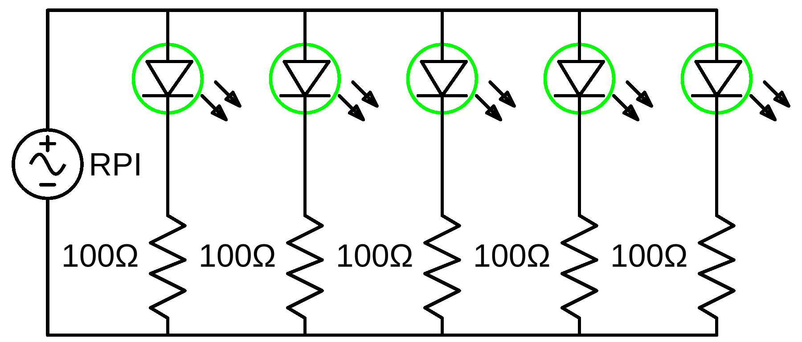

# blinking-led
This small project makes a LED blink by using nothing but a Raspberry Pi, some electrical components and 
TypeScript.
The original JavaScript code was taken from [w3schools](https://www.w3schools.com/nodejs/nodejs_raspberrypi_blinking_led.asp).
After finishing this project, you should be able to see the LED blinking.

We assume, that you are already familiar with TypeScript, know how to create a package.json file, understand
the basics of Raspberry Pi I/O and know how to connect to the Raspberry Pi. 

## Table of contents
1. [Components](#components)
2. [Design](#design)
3. [Circuit Diagram](#circuit-diagram)
4. [Dependencies](#dependencies)
5. [Code](#code)
6. [Run application](#run-application)
7. [Notes](#notes)
    1. [Parallel LED Design](#parallel-LED-design)
    2. [Parallel LED Circuit Diagram](#parallel-LED-circuit-diagram)
8. [Further reading](#further-reading)

## Components
- 1x Raspberry Pi 3
- 1x Breadboard
- 1x 100&Omega; resistor
- 1x LED (color does not really matter, we used a green one)
- 2x Female-to-male jumper wires

## Design


*Diagram created using [Fritzing](https://fritzing.org/home/)*

## Circuit Diagram
Assuming, that the Raspberry is just an AC source, and using a green LED, which has a voltage drop of 2.3V, we can 
calculate the required resistor.


The circuit can then be displayed as


*Diagram created using [EasyEDA](https://easyeda.com/)*

## Dependencies
In order to be able to use TypeScript and the other packages, we need to include these dependencies in a package.json file.
The packages needed in this project are

- [onoff](https://www.npmjs.com/package/onoff)
- [typescript](https://www.npmjs.com/package/typescript)
- [ts-node](https://www.npmjs.com/package/ts-node)

As a reference, the full can be found in the [package.json](./package.json) file.

## Code
First we need to include the `onoff` package, which handles the communication with the Raspberry Pi.
```typescript
import { Gpio } from 'onoff';
``` 
Now we can configure the pin we're going to use.
We use GPIO 24 (pin 18) and therefore we need to create a new Gpio object with the GPIO number.
The second parameter of the constructor indicates, if the pin should be used as an 'in' or 'out' pin.
We only tell the LED to turn on and off, so we can just use 'out' as the second parameter.
```typescript
const LED = new Gpio(24, 'out');
``` 
Now we need to write the methods for making the LED blink.
Blinking is just a toggling of the High and Low states.
This can be done with
```typescript
function toggleState(pin: Gpio): void {
    const pinState = pin.readSync();
    let outputState;
    if (pinState === Gpio.HIGH) {
        outputState = Gpio.LOW;
    } else {
        outputState = Gpio.HIGH;
    }
    pin.writeSync(outputState);
}
```
By using an interval, we can now make the LED blink every few milliseconds.
We will let the LED blink every 200ms
```typescript
const blinkInterval = setInterval(() => toggleState(LED), 200);
```
With this we have created a blinking LED.
In order to make the blinking stop after a while, we need to introduce a new method, which handles the stopping.
A timeout will be used to tell when to stop the blinking.
Here we will stop the blinking after 10 seconds.
```typescript
function endToggling(pin: Gpio, interval: number): void {
    clearInterval(interval);
    // Turn the pin off
    pin.writeSync(Gpio.LOW);
    // Free resources
    pin.unexport();
}
setTimeout(() => endToggling(LED, blinkInterval), 10000);
```
With this we have completed this quick tutorial.

As a reference, the full code can be found in the [index.ts](./src/index.ts) file.

## Run application
Open the console in the directory in which you stored the package.json file on your Raspberry Pi.

To run the application, type
```
npm run start
```
in the console.
After a short time, the LED should start blinking and stop after ten seconds.

## Notes
Using the same code, it is also possible to make multiple LEDs blink at the same time.
For each LED that we add, we need

- 1x Male-to-male jumper wire
- 1x 100&Omega; resistor

In the example we use five parallel green LEDs.
### Parallel LED Design


*Diagram created using [Fritzing](https://fritzing.org/home/)*

### Parallel LED Circuit Diagram


*Diagram created using [EasyEDA](https://easyeda.com/)*

## Further reading
The next two projects we will look at, are similar to this one.
They involve using multiple GPIO pins to make the LEDs blink at different times.
1. [Traffic Light](../traffic-light)
2. [Binary Counter](../binary-counter)
