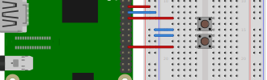

# blinking-led-with-button
This project makes a LED start and stop blinking, depending on two buttons pushed by a user.
This is done by using nothing but a Raspberry Pi, some electrical components and TypeScript.

## Table of contents
1. [Components](#components)
2. [Design](#design)
3. [Circuit Diagram](#circuit-diagram)
4. [Dependencies](#dependencies)
5. [Code](#code)
6. [Run application](#run-application)
7. [Notes](#notes)
8. [Further reading](#further-reading)

## Components
- 1x Raspberry Pi 3
- 1x Breadboard
- 1x 100&Omega; resistor
- 1x LED (color does not really matter, we used a green one)
- 2x Female-to-male jumper wires

## Design


*Diagram created using [Fritzing](https://fritzing.org/home/)*

## Circuit Diagram


*Diagram created using [EasyEDA](https://easyeda.com/)*


## Dependencies
In order to be able to use TypeScript and the other packages, we need to include these dependencies in a package.json file.
The packages needed in this project are

- [rpio](https://www.npmjs.com/package/rpio)
- [typescript](https://www.npmjs.com/package/typescript)
- [ts-node](https://www.npmjs.com/package/ts-node)

As a reference, the full can be found in the [package.json](./package.json) file.

## Code
Coming soon

## Run application
Open the console in the directory in which you stored the package.json file on your Raspberry Pi.

To run the application, type
```shell script
npm run start
```
in the console.
After a short time, the LED should start blinking.
You can press the first button to stop the blinking and the second button to start the blinking again.


## Notes
Although it is possible to achieve the same start/stop behaviour with only one button, we wanted to show how you can 
combine multiple buttons with different event listeners.

## Further reading
