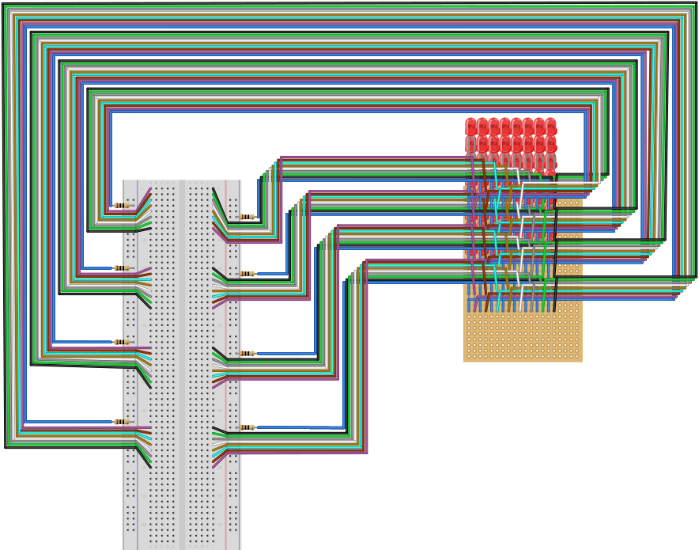

# led-matrix-8x8
Coming soon

## Table of contents
1. [Components](#components)
2. [Design](#design)
3. [Circuit Diagram](#circuit-diagram)
4. [Usage](#usage)

## Components
- 1x Perfboard (at least 16x16)
- 64x LED (color does not really matter, we used red ones)
- 64x Male-to-male jumper wires
- Soldering wire
- Soldering device

## Design

*Diagram created using [Fritzing](https://fritzing.org/home/)*

## Circuit Diagram
Coming soon

## Usage
Coming soon
