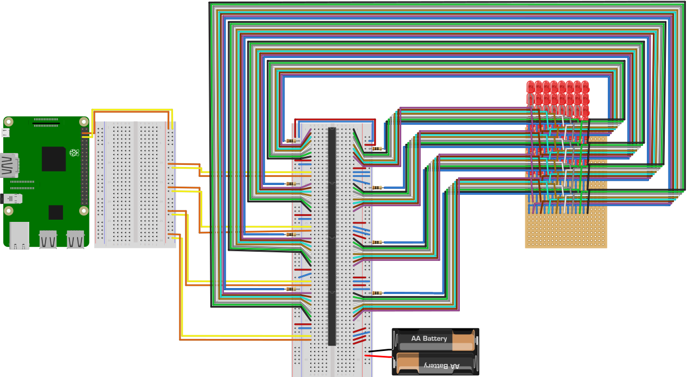

# tetris
Coming soon

## Table of contents
1. [Components](#components)
2. [Design](#design)
3. [Circuit Diagram](#circuit-diagram)
4. [Dependencies](#dependencies)
5. [Code](#code)
6. [Run application](#run-application)
7. [Notes](#notes)
8. [Further reading](#further-reading)

## Components
- 1x Raspberry Pi 3
- 1x [8x8 LED matrix](../led-matrix-8x8)
- 4x MCP23017 Port Expander
- 2x Breadboards
- 2x AA batteries
- 1x Battery holder for 2x AA batteries
- 8x 10&Omega; resistors
- 34x Male-to-male jumper wires
    - 8x for SDA/SCL
    - 8x for VDD and VSS
    - 16x for A0-A2 and RESET
    - 2x for convenience (connecting left and right side)
- 2x Female-to-male jumper wires

## Design

*Diagram created using [Fritzing](https://fritzing.org/home/)*

## Circuit Diagram
Coming soon

## Dependencies
In order to be able to use TypeScript and the other packages, we need to include these dependencies in a package.json file.
The packages needed in this project are

- [rpio](https://www.npmjs.com/package/rpio)
- [typescript](https://www.npmjs.com/package/typescript)
- [ts-node](https://www.npmjs.com/package/ts-node)

As a reference, the full can be found in the [package.json](./package.json) file.

## Code
Coming soon

## Run application
Coming soon

## Notes
Coming soon

## Further reading
Coming soon
