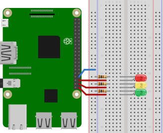

# traffic-light-with-user-input
This is the second part of the [Traffic Light](../traffic-light) project.
We do not change the circuit, but instead only work with the code.

## Table of contents
1. [Components](#components)
2. [Design](#design)
3. [Circuit Diagram](#circuit-diagram)
4. [Dependencies](#dependencies)
5. [Code](#code)
6. [Run application](#run-application)
7. [Notes](#notes)
8. [Further reading](#further-reading)

## Components
- 1x Raspberry Pi 3
- 1x Breadboard
- 3x 100&Omega; resistors
- 1x Red LED
- 1x Yellow LED
- 1x Green LED
- 4x Female-to-male jumper wires

## Design


*Diagram created using [Fritzing](https://fritzing.org/home/)*

## Circuit diagram


*Diagram created using [EasyEDA](https://easyeda.com/)*


## Dependencies
In order to be able to use TypeScript and the other packages, we need to include these dependencies in a package.json file.
The packages needed in this project are

- [onoff](https://www.npmjs.com/package/onoff)
- [prompt-sync](https://www.npmjs.com/package/prompt-sync)
- [typescript](https://www.npmjs.com/package/typescript)
- [ts-node](https://www.npmjs.com/package/ts-node)

As a reference, the full can be found in the [package.json](./package.json) file.

## Code
We continue working with the [index.ts](../traffic-light/src/index.ts) file from the [Traffic Light](../traffic-light) project.

### Single shining LED
Instead of turning each LED only on, we can make each LED to be the only one to be turned on.
For this, we need to create a separate method, where we set the currently inactive LEDs states to 'off' (=`Gpio.LOW`).

We call this method `switchTo`, with the pin to be turned on as the parameter
```typescript
function switchTo(pin: Gpio): void {
    switch (pin) {
        case RED:
            RED.writeSync(Gpio.HIGH);
            YELLOW.writeSync(Gpio.LOW);
            GREEN.writeSync(Gpio.LOW);
            break;
        case YELLOW:
            RED.writeSync(Gpio.LOW);
            YELLOW.writeSync(Gpio.HIGH);
            GREEN.writeSync(Gpio.LOW);
            break;
        case GREEN:
            RED.writeSync(Gpio.LOW);
            YELLOW.writeSync(Gpio.LOW);
            GREEN.writeSync(Gpio.HIGH);
            break;
        default:
            break;
    }
}
```

### User input
With the `switchTo` code we can now introduce some interaction with the LEDs.
Instead of waiting for timeouts, we can let the user decide when and which LED to turn on.
This can be done by introducing some user input.

The goal here is to provide a CLI, which prompts the user to type in a color.
For that we need to include a new package, prompt-sync, to the package.json file.

Now we have to remove all timeouts, since we just wait for the user input.
Since the user should have no time limitation on choosing the desired LED, we need to introduce an infinite loop
```typescript
while (true) {
    // Get user input
    let led = prompt('Which LED should be turned on? ').toLowerCase();
    if (!(led === 'red' || led === 'yellow' || led === 'green')) {
        console.log(`Sorry, we don't know ${led}. Please choose 'red', 'yellow' or 'green'.`);
        continue;
    }
    // Switch to the correct pin
    let pin;
    switch (led) {
        case "red":
            pin = RED;
            break;
        case "yellow":
            pin = YELLOW;
            break;
        case "green":
            pin = GREEN;
            break;
        default:
            // No default case
            break;
    }
    switchTo(pin);
}
```

If the user chooses one of the available LEDs, the selected LED should be turned on while the rest should stay off.

In order to be able to close the program gracefully, we need to introduce an event handler, which catches a 'CTRL+C'.
This can be done with the built-in `process` object, which handles those kind of events.
We can quickly build a closeApplication method

```typescript
function closeApplication(): void {
    LEDs.forEach(LED => freePin(LED));
    process.exit();
}
```

Now we just need to include the event listener before we start the while loop.
This is done with

```typescript
process.on('exit', () => closeApplication());
```

As a reference, the full code can be found in the [index.ts](src/index.ts) file.

## Run application

## Notes

### RESTful user input
Instead of working with a command line, it is more user-friendly to have a graphical user interface, where the user just 
needs to switch some UI buttons.
Therefore, we need to create a client-server architecture, where the server handles user requests.
We decided to use the `express` package, which offers simple REST endpoints.

As a reference, the full server code can be found in the [server.ts](src/server/server.ts) file, while the 
client can be found in the [client](./src/client) directory.

## Further reading
