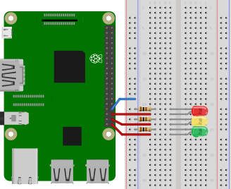
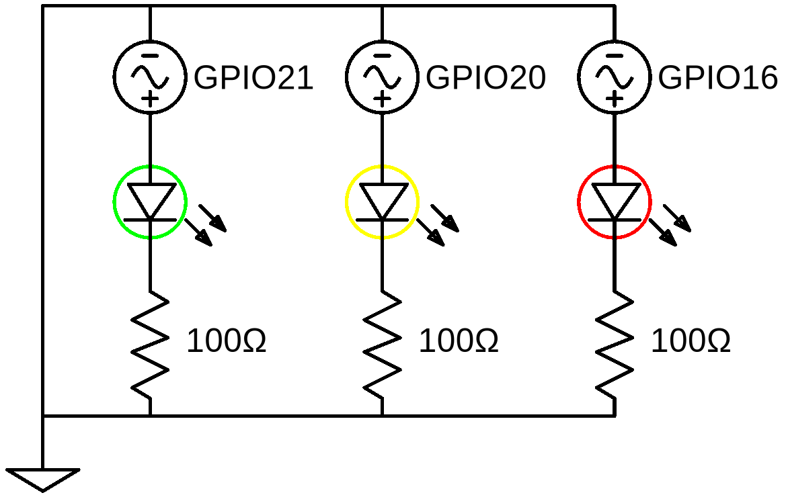

# traffic-light
This small project makes three LEDs, arranged in a traffic light pattern, turn on at different times, just like a traffic light.
This is done by using nothing but a Raspberry Pi, some electrical components and TypeScript.
After finishing this project, you should be able to see each of the three different lights light up after a certain time 
passes.

We assume, that you are already familiar with TypeScript, know how to create a package.json file, understand the basics of Raspberry Pi I/O and know how to connect to the Raspberry Pi. 

## Table of contents
1. [Components](#components)
2. [Design](#design)
3. [Circuit Diagram](#circuit-diagram)
4. [Dependencies](#dependencies)
5. [Code](#code)
6. [Run application](#run-application)
7. [Notes](#notes)
8. [Further reading](#further-reading)

## Components
- 1x Raspberry Pi 3
- 1x Breadboard
- 3x 100&Omega; resistors
- 1x Red LED
- 1x Yellow LED
- 1x Green LED
- 4x Female-to-male jumper wires

## Design


*Diagram created using [Fritzing](https://fritzing.org/home/)*

## Circuit Diagram
Assuming, that the Raspberry is just an AC source, we can calculate the required resistor values for each of the LED.
For the green LED, we have already calculated the necessary resistance value in the [Blinking LED](../blinking-led) project.


For the yellow LED we assume a voltage drop of 1.9V and therefore the resistance value is


For the red LED we assume a voltage drop of 1.8V and therefore the resistance value is


You can see, that for all three LEDs we have three different resistance values.

We can now decide what we want to do: either we use the exact values by putting resistors in series for the red and yellow 
LEDs, or we just use one single resistance value (100&Omega;) for all three LEDs.
In the latter case we have to check if the current, which will flow through the LEDs, does not exceed the maximum the LED 
can take.

A general thumb rule is a current of 20mA. If the resulting current is below that, then we can use the 100&Omega; resistors.
For the red LED we get


and for the yellow LED we get


Since both values are below 20mA, we can safely use just the 100&Omega; resistors.



*Diagram created using [EasyEDA](https://easyeda.com/)*

## Dependencies
In order to be able to use TypeScript and the other packages, we need to include these dependencies in a package.json file.
The packages needed in this project are

- [rpio](https://www.npmjs.com/package/rpio)
- [typescript](https://www.npmjs.com/package/typescript)
- [ts-node](https://www.npmjs.com/package/ts-node)

As a reference, the full can be found in the [package.json](./package.json) file.

## Code
First we need to include the `rpio` package, which handles the communication with the Raspberry Pi.
```typescript
import * as rpio from 'rpio';
``` 
Now we can configure the pins we're going to use.
We use GPIO 16 (physical pin 36) for the red LED, GPIO 20 (physical pint 38) for the yellow LED and GPIO 21 
(physical pin 40) for the green LED.

This means all three pins have to be configured as output pins.
We only tell the LEDs to turn on and off, so we can just use `rpio.OUTPUT` as the second parameter and have 
`rpio.LOW` as the default state as the third parameter.
```typescript
const PIN_RED = 36;
const PIN_YELLOW = 38;
const PIN_GREEN = 40;

rpio.open(PIN_RED, rpio.OUTPUT, rpio.LOW);
rpio.open(PIN_YELLOW, rpio.OUTPUT, rpio.LOW);
rpio.open(PIN_GREEN, rpio.OUTPUT, rpio.LOW);
```
Before the program starts, all three LEDs are off.
By using timeouts, we can define when each of the LEDs will be turned on.

First we want the red LED to be turned on, followed by the yellow and the green LED. 
Each LED should be turned on in a sequence of about 2 seconds.
The code will then look like this
```typescript
setTimeout(() => rpio.write(PIN_RED, rpio.HIGH), 0);
setTimeout(() => rpio.write(PIN_YELLOW, rpio.HIGH), 2000);
setTimeout(() => rpio.write(PIN_GREEN, rpio.HIGH), 4000);
```

The last part we have to do is freeing all resources.
This can be done with an iteration over the LED array.
The cleanup code must run after we have completed all steps and just need to clean up before the program finishes.
For this we can use another timeout.
```typescript
setTimeout(() => LEDs.forEach(LED => rpio.close(LED)), 6000);
```

As a reference, the full code can be found in the [index.ts](./src/index.ts) file.

## Run application
Open the console in the directory in which you stored the package.json file on your Raspberry Pi.

To run the application, type
```shell script
npm run start
```
in the console.
After a short time, you should see how the traffic light is first red, then only yellow and then finally only green.  

## Notes
\-

## Further reading
The next two projects let the user control the lights manually.
You can either do this with the command line or with a user interface in a browser.
1. [Traffic light with command line](./traffic-light-cmd)
2. [Traffic light with user interface](./traffic-light-ui)
