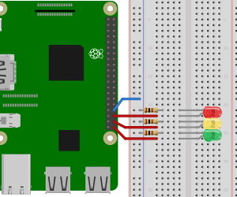
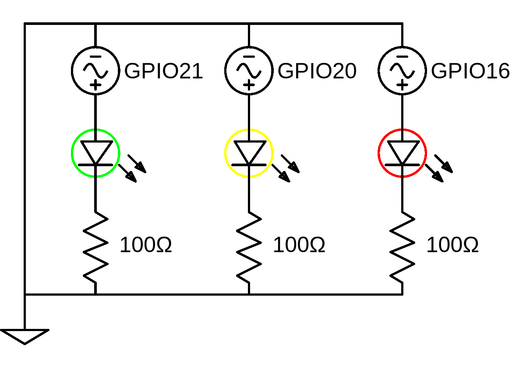

# traffic-light-with-user-input
This is the second part of the [Traffic Light](..) project.
We do not change the circuit, but instead only work with the code.

Instead of waiting for timeout, the user should be able to turn on the desired LED manually.
We can do this by providing a command line interface (CLI).
After this project is done, the user will be able to interact with the lights manually over the command line.

## Table of contents
1. [Components](#components)
2. [Design](#design)
3. [Circuit Diagram](#circuit-diagram)
4. [Dependencies](#dependencies)
5. [Code](#code)
6. [Run application](#run-application)
7. [Notes](#notes)
8. [Further reading](#further-reading)

## Components
- 1x Raspberry Pi 3
- 1x Breadboard
- 3x 100&Omega; resistors
- 1x Red LED
- 1x Yellow LED
- 1x Green LED
- 4x Female-to-male jumper wires

## Design


*Diagram created using [Fritzing](https://fritzing.org/home/)*

## Circuit diagram



*Diagram created using [EasyEDA](https://easyeda.com/)*

## Dependencies
In order to be able to use TypeScript and the other packages, we need to include these dependencies in a package.json file.
The packages needed in this project are

- [readline](https://www.npmjs.com/package/readline)
- [rpio](https://www.npmjs.com/package/rpio)
- [typescript](https://www.npmjs.com/package/typescript)
- [ts-node](https://www.npmjs.com/package/ts-node)

As a reference, the full code can be found in the [package.json](./package.json) file.

## Code
We continue working with the [index.ts](../src/index.ts) file from the [Traffic Light](..) project.

### Single shining LED
Instead of turning each LED only on, we can make each LED to be the only one to be turned on.
For this, we need to create a separate method, where we set the currently inactive LEDs states to 'off' (=`rpio.LOW`).

We call this method `switchTo`, with the pin to be turned on as the parameter
```typescript
function switchTo(pin: number): void {
    LEDs.forEach(LED => rpio.write(LED, pin === LED ? rpio.HIGH : rpio.LOW));
}
```
All but the passed pin will therefore be set to `rpio.LOW`, while the passed pin will be set to `rpio.HIGH`.

### User input
With the `switchTo` code we can introduce some interaction with the LEDs.
Instead of waiting for timeouts, we can let the user decide when and which LED to turn on.
This can be done by introducing some user input.

The goal here is to provide a CLI, which prompts the user to type in a color.
For that we need to include a new package, `readline`, in the package.json file.

If the user chooses one of the available LEDs, the selected LED should be turned on while the rest should stay off.
We do this by calling the `switchColor` method, when we receive a valid color.
```typescript
function switchColor(ledColor: string): void {
    // Switch to the correct pin
    let pin;
    switch (ledColor) {
        case "red":
            pin = PIN_RED;
            break;
        case "yellow":
            pin = PIN_YELLOW;
            break;
        case "green":
            pin = PIN_GREEN;
            break;
        default:
            // No default case
            break;
    }
    switchTo(pin);
}
```

Now we have to remove all timeouts, since we just wait for the user input.
Since the user should have no time limitation on choosing the desired LED, we need to introduce a readline event listener.
```typescript
rl.setPrompt('Which LED should be turned on? ');
rl.prompt();

rl.on('line', led => {
    if (!(led === 'red' || led === 'yellow' || led === 'green')) {
        console.log(`Sorry, we don't know ${led}. Please choose 'red', 'yellow' or 'green'.`);
    } else {
        switchColor(led);
    }
    rl.prompt();
});

```

In order to be able to close the program gracefully, we need to introduce an event handler, which catches a 'CTRL+C'.
This can be done with `readline`'s `on('close', ...)` event listener.
The code for releasing the pins and closing the app looks like this

```typescript
rl.on('close', () => {
    console.log('\nClosing the application');
    LEDs.forEach(LED => rpio.close(LED));
    process.exit(0);
});
```
With this we have created an app, which listens for some user input in the command line.

As a reference, the full code can be found in the [index.ts](src/index.ts) file.

## Run application
Open the console in the directory in which you stored the package.json file on your Raspberry Pi.

To run the application, type
```shell script
npm run start
```
in the console.
After a short time, you should a prompt in the console, asking you to input the color of the LED.
If you type in one of the available colors, you should see how this one turns on, while the previous LED turns off 
(if there was one).

You can close the application by pressing 'CTRL+C'

## Notes
\-

## Further reading
The next step is implementing a more user-friendly graphical user interface, where the user just needs to 
switch some UI buttons.
This is done in the next project, [Traffic light with user interface](../traffic-light-ui).
