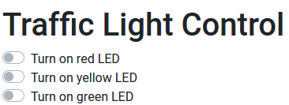

# traffic-light-ui
This is the third part of the [Traffic Light](..) project. We do not change the circuit, but instead only work with the code.

Instead of working with a command line, it is more user-friendly to have a graphical user interface, where the user just 
needs to switch some UI buttons.
Therefore, we need to create a client-server architecture, where the server handles user requests.

After this project is done, the user will be able to interact with the lights over a graphical user interface, 
which will be available at `http://localhost:9000`. If the Raspberry Pi is connected to a local network,
it should also be possible to connect to it with a different IP address.
In this project we use the IP address `192.168.1.132`. This makes the client available in the local network and therefore
a desktop computer or even a mobile phone will be able to reach it.

## Table of contents
1. [Components](#components)
2. [Design](#design)
3. [Circuit Diagram](#circuit-diagram)
4. [Dependencies](#dependencies)
5. [Code](#code)
6. [Run application](#run-application)
7. [Notes](#notes)
8. [Further reading](#further-reading)

## Components
- 1x Raspberry Pi 3
- 1x Breadboard
- 3x 100&Omega; resistors
- 1x Red LED
- 1x Yellow LED
- 1x Green LED
- 4x Female-to-male jumper wires

## Design


*Diagram created using [Fritzing](https://fritzing.org/home/)*

## Circuit diagram


*Diagram created using [EasyEDA](https://easyeda.com/)*


## Dependencies
In order to be able to use TypeScript and the other packages, we need to include these dependencies in a package.json file.
For the REST endpoints, we decided to use the popular NodeJS `express` package, which offers simple REST connections.

The packages needed in this project are

- [body-parser](https://www.npmjs.com/package/body-parser)
- [cors](https://www.npmjs.com/package/cors)
- [express](https://www.npmjs.com/package/express)
- [rpio](https://www.npmjs.com/package/rpio)
- [ts-node](https://www.npmjs.com/package/ts-node)
- [typescript](https://www.npmjs.com/package/typescript)

As a reference, the full code can be found in the [package.json](./package.json) file.

## Code

### Project structure
We are going to use the code from the previous project, but need to move it to have a better separation of client and server.
The new structure will look like this
```
traffic-light-ui
|-- package.json
|-- node_modules
|-- server
    |-- server.ts
|-- client
    |-- index.html
    |-- js
        |-- main.js
    |-- styles
        |-- bootstrap.min.css
```

### Server
Most of our code from the previous projects will stay the same, but we have to add some additional logic to make it run 
as a server.
We start with adding the necessary dependencies
```typescript
import * as express from 'express';
import * as bodyParser from 'body-parser';
import * as cors from 'cors';
```
The `express` package holds the necessary methods for creating a RESTful server.
The `body-parser` package provides the server with a middleware, which converts the request body into a JSON.
Finally, the `cors` package gives us the ability to connect to the server from a different device.
If you don't want this (or only want to connect to the server on the same machine), you can remove the code for that.

Now we can create the actual server 
```typescript
const app = express();
app.use(bodyParser.json());
app.use(cors());
```
The first line creates a HTTP server, the second tells the server to convert the request body into a JSON object and the 
third one allows us to make cross site requests.

The server needs to know where the client files are in order to be able to serve them.
The serving is done with the `express.static()` method, where the parameter is the location of the client folder.
```typescript
app.use(express.static(__dirname + '/../client'));
``` 
`__dirname` is the current working directory, and the concatenated string gives us the location of the client directory.

Now we need to tell the server to serve at a given port.
To have some feedback that the server started, we pass as a second argument a `console.log()`.
```typescript
const port: number = 9000;
const server = app.listen(port, () => console.log(`Traffic light app listening at http://localhost:${port}`));
```

The server is running, but has no endpoints.
We only need one, a `POST` endpoint, which handles the request which LED needs to be lit up.
This is done with the `app.post()` method.
```typescript
app.post('/', (req, res) => {
    const LED: string = req.body.led;
    if (!(LED === 'red' || LED === 'yellow' || LED === 'green')) {
        res.send(`Sorry, we don't know ${LED}. Please choose 'red', 'yellow' or 'green'.`);
    }
    // Switch to the correct pin
    switchColor(LED);

    // Send empty response for confirmation
    res.send();
});
```
We handle the incoming request and decide upon the received `led` string which LED to toggle.
We made a slight change here: We went back to the `toggle` method, which was used in the 
[blinking led](../../blinking-led) project.
This gives the user the ability to control the LEDs individually.
The toggle method toggles between `Gpio.LOW` and `Gpio.HIGH`.
```typescript
function toggleState(pin: number): void {
    const pinState = rpio.read(pin);
    const outputState = pinState === rpio.HIGH ? rpio.LOW : rpio.HIGH;
    rpio.write(pin, outputState);
}
```
Lastly, we need to handle closing the application in the server.
We have already covered this in the [Traffic Light with command line](../traffic-light-cmd) project.
The listener for an interrupt looks like
```typescript
process.on('SIGINT', () => {
    LEDs.forEach(LED => rpio.close(LED));  
    server.close();
    process.exit(0);
});
```

### Client
The client code uses a static [index.html](./src/client/index.html) and a [main.js](./src/client/main.js) file in
combination with [bootstrap](https://getbootstrap.com/).
If you haven't already, create a `index.html` and `main.js` file in the `client` directory.

#### index.html
In order to use the CSS and JS files, we write
```html
<link rel="stylesheet" href="styles/bootstrap.min.css" type="text/css">
<script src="js/main.js" async></script>
```
in the `<head>` tag.
This assumes, that you have already downloaded bootstrap and stored it locally in the `styles` folder.

The toggle buttons are just simple checkboxes.
```html
<input type="checkbox" id="switch-led-red">
<input type="checkbox" id="switch-led-yellow">
<input type="checkbox" id="switch-led-green">
```
So whenever you click on one of the checkboxes, the LED state should toggle.
For this we need the [main.js](src/client/js/main.js) file.

#### main.js
Before we can connect to the server, we need to tell the client where to find the server.
In our case it is at `http://192.168.1.132:9000`, but if you are running the client on the same device as the server, then
you can simply take `http://localhost:9000`.
```js
const serverURL = 'http://192.168.1.132:9000';
```
Each of the LED buttons should get a click listener, telling to toggle the chosen LED.
```js
document.querySelector('#switch-led-red').addEventListener('click', () => toggle('red'));
document.querySelector('#switch-led-yellow').addEventListener('click', () => toggle('yellow'));
document.querySelector('#switch-led-green').addEventListener('click', () => toggle('green'));
```
Now we can write the code for sending the LED color.
```js
const toggle = async (color) => {
  const data = JSON.stringify({led: color});
  try {
    await fetch(serverURL, {
      method: 'POST',
      body: data,
      headers: {
        'Content-Type': 'application/json'
      }
    });
  } catch (error) {
    console.log(error);
  }
};
```
This method uses the ES2017 (ES8) `async await` syntax for making the asynchronous code easier to read instead of using the 
`Promise` or even the `XMLHttpRequest` APIs.

The data we want to send is a JSON object with the LED color in it.
We decided to call the property `led` with the color as the value.
This is also assumed in the server.
Since the data transmission is done via a string, we need to stringify the JSON object first.
Inside the `try` block we write the request to the server.
The first parameter is the server address, the second parameter is a JSON object, which contains the necessary 
information for the server.

The method is `POST`, therefore the server will receive the request in `app.post('/')`, the body is the request body, 
which needs to include the `led` string.
The `headers` object with the content type needs to be set, so that the server knows, that the body is a JSON object.

With this the code for the client-server LED control is done.

As a reference, the full server code can be found in the [server.ts](src/server/server.ts) file, while the 
client can be found in the [client](./src/client) directory.

## Run application
Open the console in the directory in which you stored the package.json file on your Raspberry Pi.

To run the application, type
```shell script
npm run start
```
in the console.
This will start the server and also the client.
After a few seconds, you should be able to see in the console, that the server started under `http://localhost:9000`.
You should now be able to connect to `http://localhost:9000` (or whatever port you chose in [server.ts](src/server/server.ts))
in a browser.
If you want to access the server from a different device, we need to find out what address the Raspberry Pi runs on.
In our case it is `http://192.168.1.132:9000`.
You will see a page like this



Pressing one of the buttons will toggle the state of the LED.

## Notes
With this we conclude the traffic light project.

## Further reading
Try out similar LED projects, like the [binary counter](../../binary-counter).
