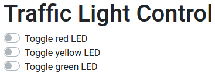

# traffic-light-ui
This is the third part of the [Traffic Light](..) project. We do not change the circuit, but instead only work with the code.

Instead of working with a command line, it is more user-friendly to have a graphical user interface, where the user just 
needs to switch some UI buttons.
Therefore, we need to create a client-server architecture, where the server handles user requests.

After this project is done, the user will be able to interact with the lights over a graphical user interface, 
which will be available at `http://localhost:9000`. If the Raspberry Pi is connected to a local network,
it should also be possible to connect to it with a different IP address.
In this project we use the IP address `192.168.1.132`. This makes the client available in the local network and therefore
a desktop computer or even a mobile phone will be able to reach it.

## Table of contents
1. [Components](#components)
2. [Design](#design)
3. [Circuit Diagram](#circuit-diagram)
4. [Dependencies](#dependencies)
5. [Code](#code)
6. [Run application](#run-application)
7. [Notes](#notes)
8. [Further reading](#further-reading)

## Components
- 1x Raspberry Pi 3
- 1x Breadboard
- 3x 100&Omega; resistors
- 1x Red LED
- 1x Yellow LED
- 1x Green LED
- 4x Female-to-male jumper wires

## Design


*Diagram created using [Fritzing](https://fritzing.org/home/)*

## Circuit diagram


*Diagram created using [EasyEDA](https://easyeda.com/)*


## Dependencies
In order to be able to use TypeScript and the other packages, we need to include these dependencies in a package.json file.
For the REST endpoints, we decided to use the popular NodeJS `express` package, which offers simple REST connections.

The packages needed in this project are

- [body-parser](https://www.npmjs.com/package/body-parser)
- [cors](https://www.npmjs.com/package/cors)
- [express](https://www.npmjs.com/package/express)
- [onoff](https://www.npmjs.com/package/onoff)
- [typescript](https://www.npmjs.com/package/typescript)
- [ts-node](https://www.npmjs.com/package/ts-node)

As a reference, the full code can be found in the [package.json](./package.json) file.

## Code

As a reference, the full server code can be found in the [server.ts](src/server/server.ts) file, while the 
client can be found in the [client](./src/client) directory.

## Run application
Open the console in the directory in which you stored the package.json file on your Raspberry Pi.

To run the application, type
```shell script
npm run start
```
in the console.
This will start the server and also the client.
You should now be able to connect to `http://localhost:9000` (or whatever port you chose in [server.ts](src/server/server.ts)).
You will see a page like this



## Notes
With this we conclude the traffic light project.

## Further reading
Try out similar LED projects, like the [binary counter](../../binary-counter).
